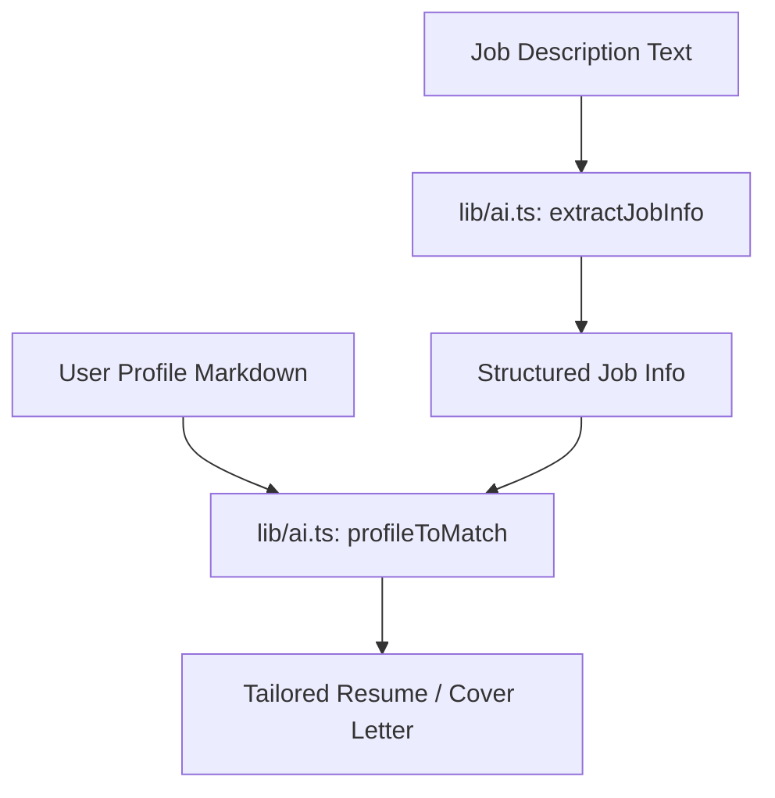

# System Overview: JOB ASSIST

JOB ASSIST is an AI-powered local application system designed to automate the process of matching candidate profiles to job descriptions, generating tailored documents, and tracking application status.

## Macro-Architecture

The system is built as a single Next.js application, utilizing the App Router and a modular directory structure. All logic is centralized in the `/lib` and `/api` directories.

### Main Components

1.  **AI Engine (`/lib/ai.ts`)**:
    -   Uses `gpt-4o-mini` to extract job information from raw text.
    -   Performs profile-to-job matching.
    -   Generates resumes and cover letters based on matched data and custom templates.
2.  **Dashboard (`/app/dashboard`)**:
    -   A high-level view of application activity.
3.  **Application Assistant (`/app/application-assistant`)**:
    -   Interactive tools for completing job application questions.
4.  **Job Watcher (`/app/job-watcher`)**:
    -   Tracks and monitors potential job opportunities from external inputs.
5.  **Profile Editor (`/app/profile-editor`)**:
    -   Manages the user's "Source of Truth" profile (Markdown).

## Core Data Flow

## Aesthetic Direction

The interface follows an **Editorial/Magazine** aesthetic:
-   **Typography**: Playfair Display for headers, IBM Plex Mono for functional text.
-   **Color Palette**: Beige (#f4f4f0), Black, and Grays (#e5e5df), avoiding generic purple/blue gradients common in AI tools.
-   **Interaction**: Subtle, staggered reveals and high-contrast hover states.

---
*Last Updated: 2026-04-07*
