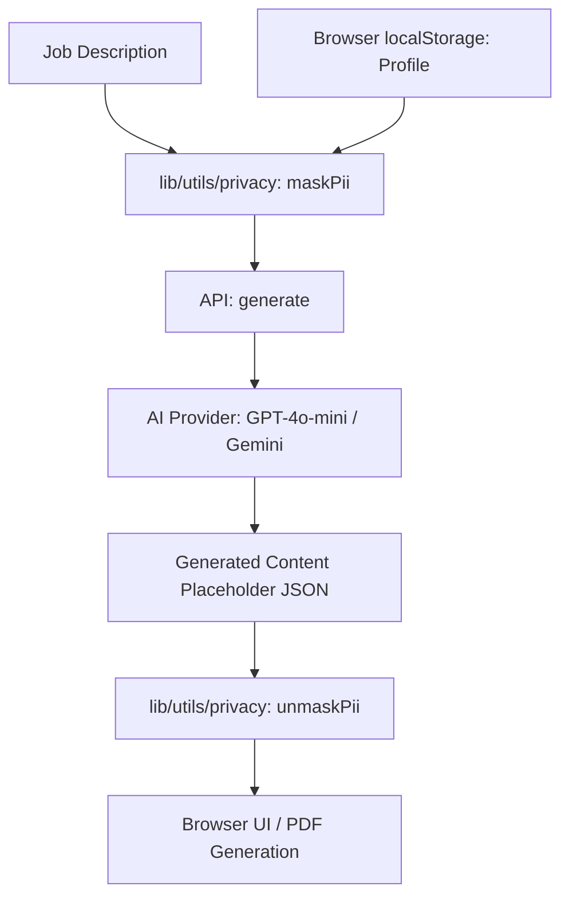

# System Overview: APPLYER

APPLYER is an AI-powered, client-first application designed to automate job applications while maintaining absolute user privacy through a stateless "Bring Your Own Key" (BYOK) architecture.

## Macro-Architecture

The system is built with Next.js (App Router) and operates as a stateless engine. All persistent user data (API keys, professional profiles, and privacy settings) resides exclusively in the user's browser `localStorage`, ensuring that the server never stores sensitive information.

### Main Components

1.  **Stateless AI Engine (`/lib/ai/`)**:
    -   Utilizes provider factories to initialize OpenAI, Gemini, or Local LLM instances using dynamic keys provided by the client.
2.  **JOB BANK (Radar Network)**:
    -   A fully client-side job source tracker. It allows users to manage multiple career sites and scan them for new listings. All source metadata and job "hits" are stored in `localStorage` (`applyer_sources`).
3.  **Privacy Guard (`/lib/utils/privacy.ts`)**:
    -   A client-side interceptor that masks PII (Personally Identifiable Information) before LLM transmission and unmasks it for local display/PDF generation.
4.  **Document Extraction Engine**:
    -   Uses a serverless-optimized `pdf-parse` (v2.4.5) implementation to extract raw text from resumes for profile auto-population without storing files.
5.  **Modular Workspace**:
    -   **Assistant**: Generative dashboard for resumes, cover letters, and Q&A.
    -   **Profile Editor**: Structured form and resume parser for building the core markdown profile.
    -   **Settings**: Secure management of API keys and PII masking configurations.
6.  **Content Protection**:
    -   Strict **Content Security Policy (CSP)** and **DOMPurify** sanitization to prevent XSS-based key theft.

## Core Data Flow

## Aesthetic Direction

The interface follows an **Editorial/Magazine** aesthetic:
-   **Typography**: Playfair Display for headers, IBM Plex Mono for functional text.
-   **Color Palette**: Beige (#f4f4f0), Black, and accent colors (#ff5e5b, #e8fc3b).
-   **Interaction**: Minimalist sidebar navigation with high-contrast active states.

---
*Last Updated: 2026-05-07*
